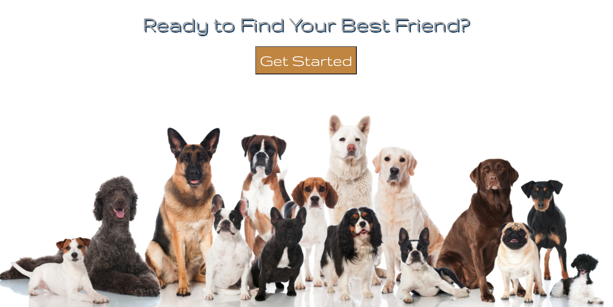

## **Overview**
Ultimutt Match is an application designed to match prospective dog owners with furbabies in the Santa Barbara Area. This website allows the dogs to be filtered by zip code, breed, age, gender, or size. It also allows the user to favorite dogs in order to come back to them later. Each dog has a description made by the shelter and an email link to contact them. If you've been wanting a dog, please have a look at some of these cute little faces. I promise you will not be dissappointed. 

## **Technologies**
- JavaScript
- React.js
- Redux
- CSS
- Bootstrap 
- React Bootstrap
- RESTful API 
    - https://ultimuttmatchdogapi.herokuapp.com/all_dogs : I made this API with data I found from Petfinder API and hosted it through Heroku

## **The Idea**

## **The Final Product**

